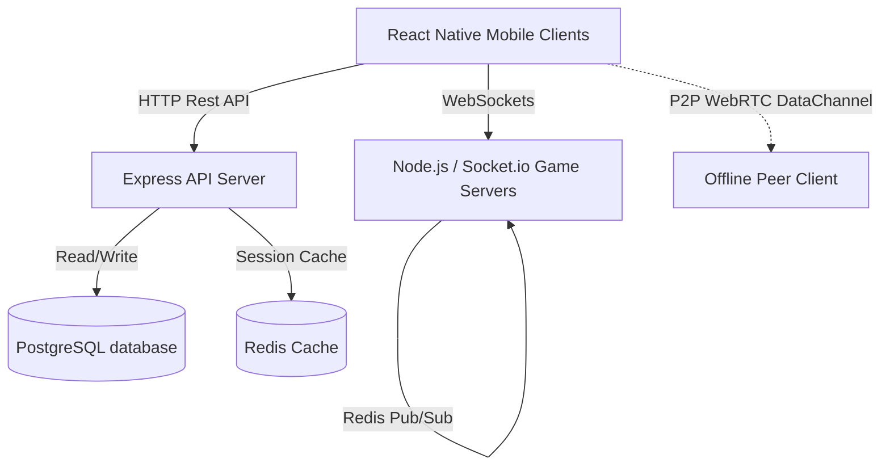

# NG Whot — Architectural Specification

This document details the software design, database schemas, P2P network topology, and transaction workflows planned for production target platforms (Mobile App with React Native / Node.js backend).

---

## 1. Production Architecture Overview



- **REST API**: Handles auth, profile management, wallet funding/withdrawals, social followers, and leaderboards.
- **WebSocket Cluster**: Manages real-time match lobbies, game card states, timers, and in-game chatrooms.
- **Redis**: Stores active game state caches for instant recovery on disconnect and orchestrates pub/sub for scalability across multiple server instances.

---

## 2. Database Models (PostgreSQL Schemas)

### Users Table
```sql
CREATE TABLE users (
  id UUID PRIMARY KEY DEFAULT gen_random_uuid(),
  username VARCHAR(50) UNIQUE NOT NULL,
  password_hash VARCHAR(255) NOT NULL,
  default_tribe VARCHAR(20) CHECK (default_tribe IN ('Igbo', 'Yoruba', 'Hausa', 'Efik')),
  points INT DEFAULT 0,
  games_played INT DEFAULT 0,
  games_won INT DEFAULT 0,
  games_lost INT DEFAULT 0,
  wallet_balance NUMERIC(12, 2) DEFAULT 0.00,
  kyc_status VARCHAR(20) DEFAULT 'Unverified' CHECK (kyc_status IN ('Unverified', 'Pending', 'Verified')),
  status VARCHAR(20) DEFAULT 'Active' CHECK (status IN ('Active', 'Banned')),
  created_at TIMESTAMP DEFAULT CURRENT_TIMESTAMP
);
```

### Followers Table
```sql
CREATE TABLE followers (
  id SERIAL PRIMARY KEY,
  follower_id UUID REFERENCES users(id) ON DELETE CASCADE,
  following_id UUID REFERENCES users(id) ON DELETE CASCADE,
  status VARCHAR(20) DEFAULT 'Pending' CHECK (status IN ('Pending', 'Accepted')),
  created_at TIMESTAMP DEFAULT CURRENT_TIMESTAMP,
  UNIQUE(follower_id, following_id)
);
```

### Matches Table
```sql
CREATE TABLE matches (
  id UUID PRIMARY KEY DEFAULT gen_random_uuid(),
  creator_id UUID REFERENCES users(id),
  player_count INT DEFAULT 2,
  timer_mode VARCHAR(20) DEFAULT 'rapid',
  wager_amount NUMERIC(10, 2) DEFAULT 0.00,
  winner_id UUID REFERENCES users(id) NULL,
  platform_fee NUMERIC(10, 2) DEFAULT 0.00,
  status VARCHAR(20) DEFAULT 'Completed' CHECK (status IN ('Active', 'Completed', 'Cancelled')),
  created_at TIMESTAMP DEFAULT CURRENT_TIMESTAMP
);
```

---

## 3. Financial Transaction Workflows

### Wagers and Platform Commissions
1. When joining a monetized custom game or public tournament, the entry fee is immediately **deducted** from the user's `wallet_balance` and moved to a platform-escrow status.
2. Upon match completion, the winner is awarded:
   $$\text{Winnings} = (\text{Wager} \times \text{Player Count}) \times 0.90$$
   *(10% platform commission is automatically retained as system revenue).*

### Cashout Withdrawals
1. The user requests a withdrawal to a Nigerian bank account (OPay, GTBank, Access Bank, etc.).
2. The system calculates a **1.5% transactional withdrawal fee** and locks the funds.
3. The Admin Portal operator reviews and approves the payout, releasing the transaction through payment gateways (e.g. Flutterwave or Paystack APIs).

---

## 4. Offline P2P Synchronization

When internet access is unavailable, the React Native application establishes local matches using two distinct models:

1. **Bluetooth Pairing (Nearby API)**:
   - One device acts as the **Advertising Host** using the `react-native-ble-manager` or Android/iOS local socket API.
   - Guest devices perform discovery, pair, and establish local RFCOMM data streams to sync card actions and clock intervals.

2. **WiFi Hotspot Local Network**:
   - The host device creates a portable Wi-Fi Hotspot.
   - Guest devices connect to the host's WiFi network.
   - The host spins up a local WebSocket/HTTP server on a private subnet IP (e.g., `192.168.43.1:8080`), allowing guest clients to join.
